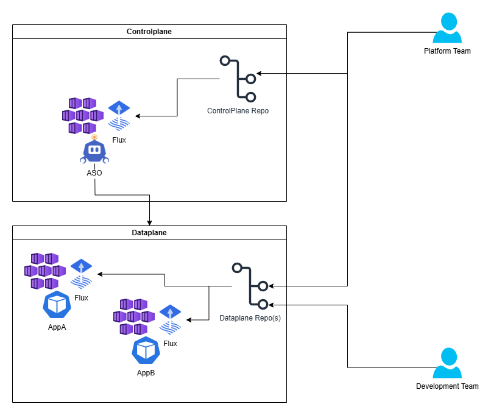

# Multi-Cluster AKS Management using Flux and ASO
This repo provides a sample implementation using [Flux](https://fluxcd.io/) and [Azure Service Operator](https://azure.github.io/azure-service-operator/)(ASO) to manage a dynamic fleet of Azure Kubernetes Clusters(AKS). This guide is geared towards organizaitons that are interested in managing a number of AKS clusters using a declarative model with kubernetes as the preferred interface for operations and administration. By leveraging the managed capabilities available on Azure such as [AKS](https://learn.microsoft.com/azure/aks/), the [GitOps Flux extension for AKS](https://learn.microsoft.com/azure/azure-arc/kubernetes/tutorial-use-gitops-flux2) and [Managed Identities](https://learn.microsoft.com/azure/aks/workload-identity-overview), we are able to minimize the operational overhead of running a complex fleet and very quickly build a large number of kubernetes clusters each tailored to a particular purpose.

## Architecture


## Build the Control Plane Cluster
In order to bootstrap the fleet we need our first ASO cluster. This cluster will be the proverbial chicken that lays the first egg. This is a one-time imperative task that can be made fully declarative once we bootstrap the system. If you already have a k8s cluster, please follow the instructions for [installing and configuring ASO](https://azure.github.io/azure-service-operator/guide/). For the purposes of this guide, we will start by deploying a basic AKS cluster.

```bash
LOCATION=eastus2
CONTROLPLANE_GROUP=controlplane-rg
ASO_CLUSTER=asocluster-aks
SUBID=$(az account show -o tsv --query id)
TENANT=$(az account show -o tsv --query tenantId)
USERNAME=$(az account show -o tsv --query user.name)

az group create -n $CONTROLPLANE_GROUP -l $LOCATION
ASOID=$(az aks create -g $CONTROLPLANE_GROUP -n $ASO_CLUSTER --node-count 1 --enable-oidc-issuer --enable-workload-identity --generate-ssh-keys -o tsv --query id)
```

ASO will need permission to create clusters and backing resources. To support this, we will create a user-assigned managed identity and configure it as a workload identity federated to the controlplane cluster.

```bash
ASO_IDENTITY_NAME=aso-controlplane-identity
IDENTITY=$(az identity create -g $CONTROLPLANE_GROUP -n $ASO_IDENTITY_NAME -o tsv --query clientId)

# Establish trust between the ASO cluster service account for ASO and the UMI
ISSUER=$(az aks show -g $CONTROLPLANE_GROUP -n $ASO_CLUSTER -o json | jq -r '.oidcIssuerProfile.issuerUrl')
az identity federated-credential create --name aso-federated-credential \
    --identity-name $ASO_IDENTITY_NAME -g $CONTROLPLANE_GROUP \
    --issuer $ISSUER \
    --subject "system:serviceaccount:azureserviceoperator-system:azureserviceoperator-default" \
    --audiences "api://AzureADTokenExchange"
```

In order for ASO to use the workload identity for resource management, it needs to know the subscription, tenant and clientID to use. We will store those in the cluster as a secret which we can reference in the ASO deployment.
```bash
az aks get-credenitals -g $CONTROLPLANE_GROUP -n $ASO_CLUSTER --overwrite-existing
kubectl create secret generic aso-identity -n cluster-config --from-literal=values.yaml="
azureSubscriptionID: $SUBID
azureTenantID: $TENANT
azureClientID: $IDENTITY
"
```

Now we just need to install flux and point it at the controlplane repository to bootstrap ASO onto the cluster.

> [!NOTE]
> Replace the url below with that of your fork
```bash
az k8s-configuration flux create \
    -g $CONTROLPLANE_GROUP \
    -c $ASO_CLUSTER \
    -n cluster-config \
    --namespace cluster-config \
    -t managedClusters \
    --scope cluster \
    -u https://github.com/markjgardner/aks-multi-cluster-management \
    --branch main \
    --kustomization name=controlplane path=./flux/controlplane prune=true
```

We now have a controlplane cluster running ASO and using flux to pull its configuration from our platform repository. The next step will be to enable this cluster to create other clusters and configure it to do so automatically based on declarative templates that describe different types of workload clusters.

## Deploy Workload Clusters

First we will create a resource group to hold the workload clusters and delegate access to the ASO identity allowing it to create new clusters.

```bash
FLEET_GROUP=myfleet-rg
az group create -n $FLEET_GROUP -l $LOCATION
az role assignment create --role "Contributor" --assignee $IDENTITY --scope /subscriptions/$SUBID/resourceGroups/$FLEET_GROUP
```

Workload cluster definitions can be placed in the [/flux/clusters](/flux/clusters) folder. To deploy new clusters whenever a resource definition is pushed to this folder we need to add another kustomization to the controlplane.

```bash
az k8s-configuration flux kustomization create \
    -g $CONTROLPLANE_GROUP \
    -c $ASO_CLUSTER \
    -n cluster-config \
    -t managedClusters \
    -k clusters \
    --path ./flux/clusters \
    --prune true \
    --interval 1m
```

## Cluster Definitions as Helm Charts

If we think of our clusters as just abstract compute environments for hosting applications, the next logical leap is to create templates for defining those environments. In this way we can stamp out new environments and scale up and down easily by reusing the template to create more or fewer clusters. [Helm](https://helm.sh) is one of the most robust templating tools for kubernetes resources and is natively supported by Flux. So, let's look at a very basic example of a cluster defined as a helm chart.

> [!NOTE]
> The full source for this chart can be found under [/charts/podinfocluster](/charts/podinfocluster).
```yaml
apiVersion: containerservice.azure.com/v1api20240901
kind: ManagedCluster
metadata:
  name: {{ .Release.Name }}-aks
spec:
  location: {{ .Values.location }}
  owner:
    name: myfleet-rg
  agentPoolProfiles:
    - name: system
      enableAutoScaling: true
      minCount: 1
      maxCount: 3
      vmSize: standard_d2as_v6
      osType: Linux
      osSKU: AzureLinux
      mode: System
  identity:
    type: SystemAssigned
  dnsPrefix: {{ .Release.Name }}-aks
```

These workload clusters can be easily defined with their own `FluxConfiguration` which will configure the cluster with the appropriate workload resources.
```yaml
apiVersion: kubernetesconfiguration.azure.com/v1api20230501
kind: FluxConfiguration
metadata:
  name: flux-config
spec:
  gitRepository:
    repositoryRef:
      branch: main
    url: {{ .Values.flux.repository }}
  kustomizations:
    apps: 
      force: false
      path: {{ .Values.flux.kustomizationPath }}
      prune: true
      syncIntervalInSeconds: 600
      timeoutInSeconds: 600
      wait: true
  namespace: cluster-config
  owner:
    group: containerservice.azure.com
    kind: ManagedCluster
    name: {{ .Release.Name }}-aks
  sourceKind: GitRepository
```

To deploy instances of this workload cluster, we just need to create a `HelmRelease` within our controlplane repo. Notice that you can create additional environments by defining new releases of the same chart. 

```yaml
apiVersion: helm.toolkit.fluxcd.io/v2
kind: HelmRelease
metadata:
  name: podinfostage
  namespace: cluster-config
spec:
  releaseName: podinfo-stage
  targetNamespace: clusters
  chartRef:
    kind: OCIRepository
    name: aso-cluster-charts
  interval: 5m
  values:
    location: eastus2
    clusterCount: 1
    flux:
      kustomizationPath: ./apps/staging
      repository: https://github.com/Azure/gitops-flux2-kustomize-helm-mt
```

Scaling a release (adding/removing clusters) can be accomplished by parameterizing the desired number of clusters and leveraging the builtin capabilities of helm to render the appropriate number of resources on the controlplane cluster.
```yaml
{{- range $i := until (int .Values.clusterCount) }}
apiVersion: containerservice.azure.com/v1api20240901
kind: ManagedCluster
...
```

As an example, this `HelmRelease` will deploy a production version of our PodInfo cluster definition across three AKS clusters. Executing this deployment is as simple as adding the following block to [/flux/clusters/podinfoClusters.yaml](/flux/clusters/podinfoClusters.yaml)
```yaml
apiVersion: helm.toolkit.fluxcd.io/v2
kind: HelmRelease
metadata:
  name: podinfoprod
  namespace: cluster-config
spec:
  releaseName: podinfo-prod
  targetNamespace: clusters
  chartRef:
    kind: OCIRepository
    name: aso-cluster-charts
  interval: 5m
  values:
    clusterCount: 3
    location: eastus2
    flux:
      kustomizationPath: ./apps/production
```

## Additional Notes

This example focuses solely on managing AKS clusters through ASO, however, it should be noted that any Azure resource [supported by ASO](https://azure.github.io/azure-service-operator/reference/) can be managed in this model. For example, a workload chart could contain the definition for the application cluster as well as external dependencies such as Azure SQL, Azure Storage, Application Insights, etc.
